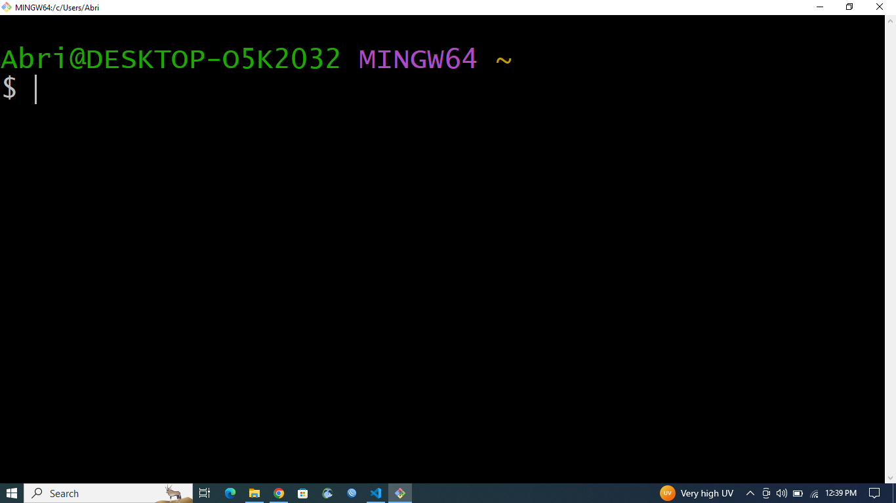
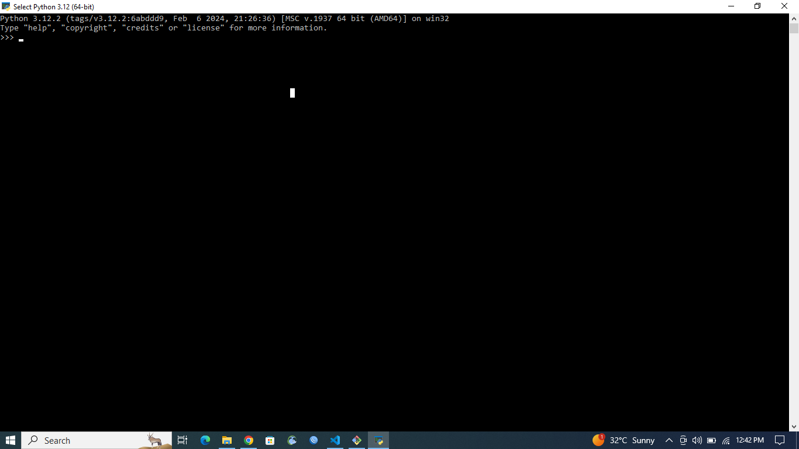
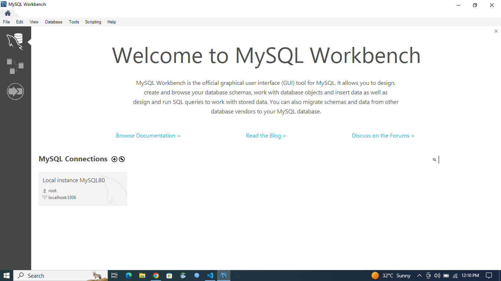

# Dev_Setup
Setup Development Environment

#Assignment: Setting Up Your Developer Environment

#Objective:
This assignment aims to familiarize you with the tools and configurations necessary to set up an efficient developer environment for software engineering projects. Completing this assignment will give you the skills required to set up a robust and productive workspace conducive to coding, debugging, version control, and collaboration.

#Tasks:

1. Select Your Operating System (OS):
   Choose an operating system that best suits your preferences and project requirements. Download and Install Windows 11. https://www.microsoft.com/software-download/windows11

I have windows 10 installed

1. Install a Text Editor or Integrated Development Environment (IDE):
   Select and install a text editor or IDE suitable for your programming languages and workflow. Download and Install Visual Studio Code. https://code.visualstudio.com/Download

2. Set Up Version Control System:
   Install Git and configure it on your local machine. Create a GitHub account for hosting your repositories. Initialize a Git repository for your project and make your first commit. https://github.com

   

3. Install Necessary Programming Languages and Runtimes:
  Instal Python from http://wwww.python.org programming language required for your project and install their respective compilers, interpreters, or runtimes. Ensure you have the necessary tools to build and execute your code.

  

1. Install Package Managers:
   If applicable, install package managers like pip (Python).

   I installed

2. Configure a Database (MySQL):
   Download and install MySQL database. https://dev.mysql.com/downloads/windows/installer/5.7.html

   Done with it.
   

3. Set Up Development Environments and Virtualization (Optional):
   Consider using virtualization tools like Docker or virtual machines to isolate project dependencies and ensure consistent environments across different machines.

4. Explore Extensions and Plugins:
   Explore available extensions, plugins, and add-ons for your chosen text editor or IDE to enhance functionality, such as syntax highlighting, linting, code formatting, and version control integration.

I install extensions and plugins.

5. Document Your Setup:
    Create a comprehensive document outlining the steps you've taken to set up your developer environment. Include any configurations, customizations, or troubleshooting steps encountered during the process. 

#Deliverables:
- Document detailing the setup process with step-by-step instructions and screenshots where necessary.
- A GitHub repository containing a sample project initialized with Git and any necessary configuration files (e.g., .gitignore).
  
Steps to install visual studio code for windows

-I went visual studio code website and clicked on the "download for windows" button and downloaded the installer. 
-I ran the .exe installer file
-I followed the onscreen instructions and clicked on "next" and then "install" button

steps to install git for windows

-visited git website and click on "download for windows" button
-I ran the .exe installer file
-I followed the onscreen instructions and accepted the license agreement and then "install" button
-clicked on finished button to finalize the installation

steps to install python for windows
-Visited the python website
-chose the version and click on download python[version] button to download the latest version
-ran the .exe installer
-i added the python to path
-click on install now button for a quick installation with default settings
-I waited for installation to complete and clicked on finish button
-I ran python --version to confirma it is installed. 

Steps to install mysql for windows

-visited mysql website
-choose the installer and clicked on "mysql install for windows" link and chose the appropriate version
-i chose the full installer recommended
-click on no thanks button to start the download
-I ran the installer
I follwoed the onscreen instructions until i set up everyhing successfully
-i open mysql command line and ran select version

- A reflection on the challenges faced during setup and strategies employed to overcome them.

It was really difficult to install python and django but i waited for class to start and finished.
It attaching the screen to visual studio code is realy hard so I had to copy and paste. However, the pictures are visible on the screen.

#Submission:
Submit your document and GitHub repository link through the designated platform or email to the instructor by the specified deadline.

#Evaluation Criteria:**
- Completeness and accuracy of setup documentation.
- Effectiveness of version control implementation.
- Appropriateness of tools selected for the project requirements.
- Clarity of reflection on challenges and solutions encountered.
- Adherence to submission guidelines and deadlines.

Note: Feel free to reach out for clarification or assistance with any aspect of the assignment.
